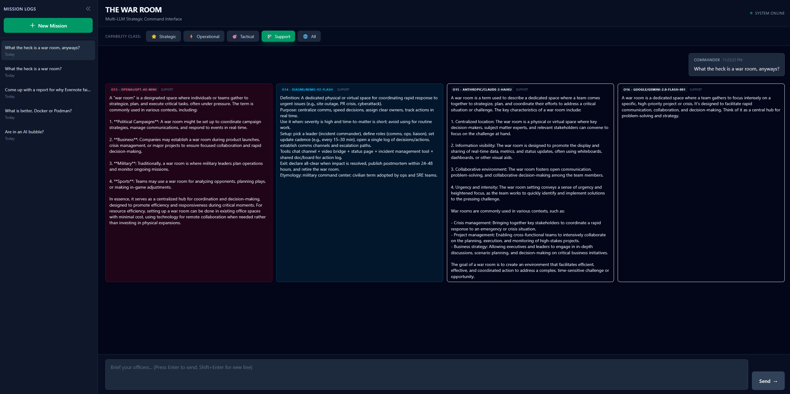

# The War Room

A multi-LLM strategic interface that queries multiple AI models in parallel to get diversified opinions and perspectives on any question.



### Demo Video

[Watch the demo](docs/images/war_room_demo.mp4)

## What is this?

The War Room is a council of LLMs with different personalities and capabilities. Instead of getting a single response from one model, you get varied responses from multiple "officers" - each with their own specialty, personality, and approach to problem-solving.

This is an experiment to:
- Get diversified opinions on a single query
- Hear from different AI personalities and reasoning styles
- Compare responses across different model providers and tiers
- Leverage the strengths of multiple LLMs simultaneously

## Architecture

- **Frontend**: Next.js 15 with TypeScript and Tailwind CSS
- **Database**: Prisma with SQLite for session persistence
- **LLM Gateway**: OpenRouter API for unified access to multiple models
- **Deployment**: Docker Compose for containerized local development

## Features

- **Dynamic Fan-Out**: Parallel queries to multiple LLMs
- **Capability Tiers**: Strategic, Operational, Tactical, and Support models
- **Session Persistence**: Save and resume conversations
- **Horizontal Card Layout**: Compare responses side-by-side
- **Mode Indicators**: See which capability tier was used for each response

## Getting Started

### Prerequisites

- Docker and Docker Compose
- OpenRouter API key ([get one here](https://openrouter.ai))

### Setup

1. Clone the repository:
```bash
git clone https://github.com/harris-mohamed/war-room.git
cd war-room
```

2. Create a `.env` file:
```bash
cp .env.example .env
```

3. Add your OpenRouter API key to `.env`:
```
OPENROUTER_API_KEY=your_key_here
```

4. Start the application:
```bash
docker compose up -d
```

5. Open http://localhost:3000 in your browser

## Configuration

Edit `/config/roster.json` to:
- Add or remove officers
- Change which models are used
- Modify officer personalities and system prompts
- Set capability class tiers
- Adjust active roster

See [CLAUDE.md](CLAUDE.md) for detailed architecture documentation.

## Docker Commands

```bash
# Start containers
docker compose up -d

# Rebuild after code changes
docker compose down && docker compose up -d --build

# View logs
docker compose logs -f

# Stop containers
docker compose down
```

## Project Structure

```
/app                    # Next.js app directory
  /api                 # API routes
    /chat             # LLM query endpoint
    /sessions         # Session management
  /components         # React components
/config               # Officer roster configuration
/lib                  # Utilities and integrations
/prisma              # Database schema and migrations
```

## License

MIT
